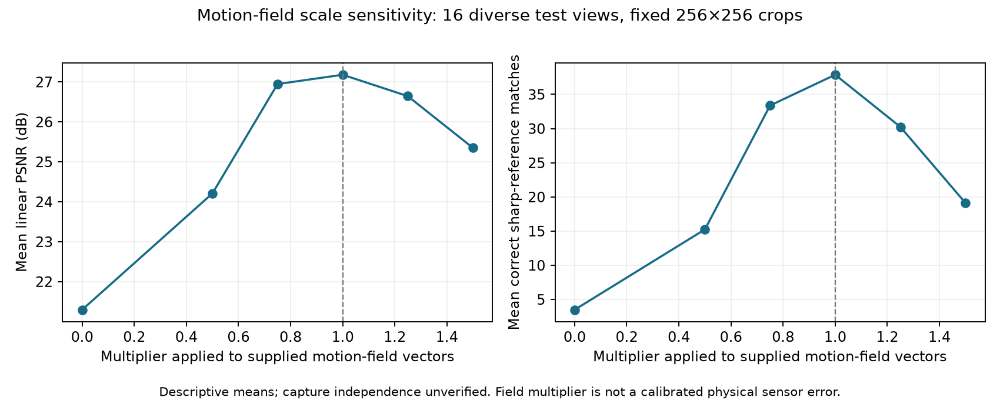

# Motion-Aware Image Deblurring for Robust Robotic Visual Perception

**M.Tech Thesis — Ongoing**  
**Author:** Guruvignesh R M  
**Project snapshot:** 9 October 2026

## Project overview

This thesis investigates deep-learning-based image deblurring using gyroscope motion cues, with the aim of recovering visual features degraded by camera motion. It compares image-only and gyroscope-assisted restoration and studies how inaccurate motion guidance affects image quality and feature recovery.

Robotic visual perception is the intended application. The current experiments evaluate image crops and same-image sharp-reference feature recovery; robot deployment, inter-frame tracking and SLAM have not yet been evaluated.

## Objectives

- Compare pretrained image-only and gyroscope-assisted deblurring on matched inputs.
- Evaluate restoration using PSNR, SSIM and geometrically verified ORB feature matches.
- Study sensitivity to motion guidance, then validate physically meaningful sensor-error experiments.
- Investigate reliability improvements if supported by failure analysis and the thesis scope.

## Work completed

- Reviewed a focused shortlist of 45 deblurring and perception papers.
- Implemented and executed a comparative evaluation pipeline using official pretrained **GyroDeblurNet** and **Restormer** checkpoints.
- Completed an initial 16-image feasibility test and an expanded study of **16 varied test views × 19 conditions = 304 measurements**. One image overlaps the initial test.
- Tested motion-field scaling, image-plane vector rotation and additive field errors while keeping input images and model weights fixed.
- Evaluated PSNR, SSIM and ORB recovery against each image's sharp reference; recorded inference latency and memory.

## Preliminary results

Expanded study: 256 × 256 center crops, FP32 inference, fixed feature-matching thresholds. Values below are means over the same 16 views.

| Condition | PSNR (dB) | Correct sharp-reference matches |
|---|---:|---:|
| Untreated blur | 20.15 | 0.06 |
| GyroDeblurNet with supplied motion field | 27.18 | 37.88 |
| GyroDeblurNet with half-strength motion field | 24.21 | 15.25 |
| GyroDeblurNet with 15° image-plane field rotation | 26.27 | 26.69 |
| Restormer with direct input | 19.90 | 0.44 |

Halving guidance strength reduced correct recovered matches in all 16 tested views. This is preliminary evidence of sensitivity to motion guidance, not a claim of a novel algorithm or improved robotic navigation.



### Interpretation limits

- The models differ in architecture and training data: GyroDeblurNet uses GyroBlur-Synth and Restormer uses GoPro. This comparison does not isolate the causal benefit of gyroscope conditioning.
- Views include shared locations; independent capture groups have not been verified. No statistical significance is claimed.
- Matches are measured against the same image's sharp reference, not between successive camera frames.
- Raw-gyro reconstruction does not exactly reproduce the supplied motion fields. Current perturbations are **field-level stress tests**, not calibrated timing, gyro-noise or camera–IMU calibration experiments.
- No model training, new restoration architecture or SLAM integration is claimed.

## Next steps

- [ ] Resolve the raw-gyro-to-motion-field reproduction discrepancy.
- [ ] Establish scene/sequence-separated data and independent inter-frame geometric truth.
- [ ] Evaluate validated sensor errors and task-harm cases.
- [ ] Assess whether a reliability improvement provides a defensible thesis contribution.
- [ ] Release the cleaned inference pipeline and fuller experimental artifacts as the project matures.

## Repository contents

- [Detailed experimental report](results/Robustness_Report.md)
- [All 304 per-condition measurements](results/measurements.csv)
- [Aggregate results](results/summary.json)
- [Protocol](results/protocol.json) and [model/environment settings](results/settings.json)
- [Result verification script](scripts/verify_results.py)
- [Third-party references and attribution](REFERENCES.md)

To verify the published measurements using Python's standard library:

```bash
python scripts/verify_results.py
```

This initial public release documents ongoing work and includes measured results. It is not yet a self-contained neural-inference release. Model weights, datasets, downloaded papers and private working documents are not redistributed here.

**Tools used:** Python, PyTorch, torchvision, NumPy, scikit-image, CUDA and Matplotlib.
